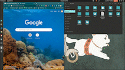

# Demonstration
Tested with **Dabian** based linux distributions only

<!--  -->

# Instructions
- Import the tested `conda` environment with  
`conda env create -f environment.yml` 
- Then run `python 4_active_window.py`

# Known Issues
Opening new window might throw an exception.